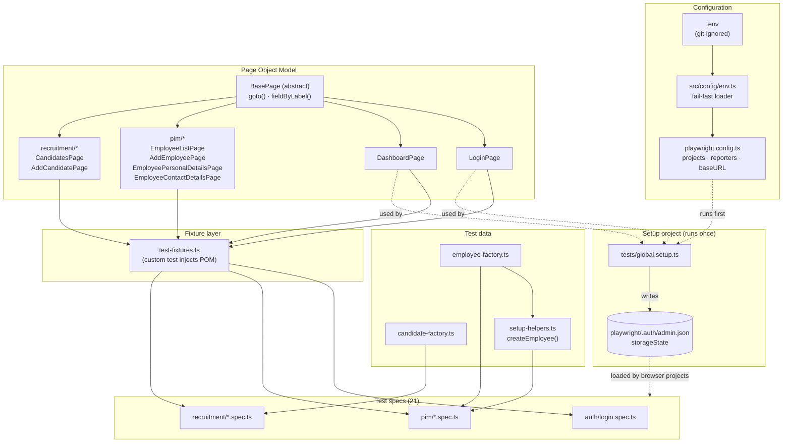
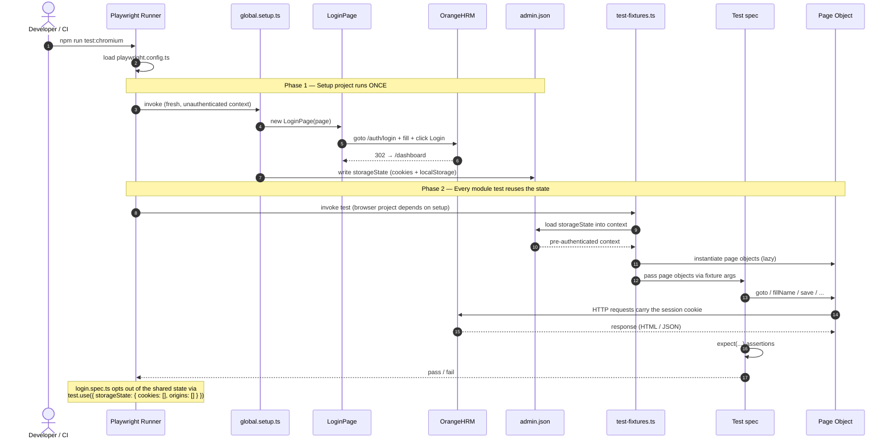

# OrangeHRM — Test Automation Framework

End-to-end test framework for the [OrangeHRM demo site](https://opensource-demo.orangehrmlive.com/), built with **Playwright** and **TypeScript**.

> See [exercise.md](./exercise.md) for the full assignment brief.

## Stack

- **Playwright** — browser automation, runner, reporting, traces.
- **TypeScript** — typed test code.
- **Page Object Model** — page objects under `src/pages`, exposed to tests via Playwright fixtures in `src/fixtures`.
- **Setup project + `storageState`** — admin login runs once per test run; module tests start authenticated.
- **Faker (`@faker-js/faker`)** — realistic names, phones, and emails for test data.
- **dotenv** — `BASE_URL` / credentials are env-overridable, with a committed `.env.example`.
- **ESLint + Prettier + Husky** — flat-config ESLint with the Playwright plugin, Prettier formatting, and a pre-commit hook (lint-staged + `tsc --noEmit`).
- **GitHub Actions CI** — `.github/workflows/test.yml`: lint + typecheck + format on every PR; chromium tests on every PR; full browser matrix nightly.

## Project layout

```
.
├── exercise.md                              # Assignment brief
├── playwright.config.ts                     # Runner config: setup project, browser projects, reporters
├── tsconfig.json
├── eslint.config.mjs                        # ESLint 9 flat config
├── .prettierrc.json
├── .husky/pre-commit                        # lint-staged + typecheck
├── .env.example                             # Copy to .env (git-ignored) to override defaults
├── .github/workflows/test.yml               # CI — lint, typecheck, browsers
├── src/
│   ├── config/
│   │   ├── env.ts                           # BASE_URL, ADMIN_USER, ADMIN_PASSWORD (env-overridable)
│   │   └── paths.ts                         # Filesystem paths (e.g. storageState location)
│   ├── data/
│   │   ├── employee-factory.ts              # Generates uniquely-named employee data per test
│   │   ├── candidate-factory.ts             # Generates uniquely-named candidate data per test
│   │   └── setup-helpers.ts                 # createEmployee() — shared arrange-step for PIM tests
│   ├── fixtures/
│   │   └── test-fixtures.ts                 # Custom `test` with all page objects injected
│   └── pages/
│       ├── BasePage.ts                      # Shared `goto()` + label-proximity field helper
│       ├── LoginPage.ts
│       ├── DashboardPage.ts
│       ├── pim/
│       │   ├── EmployeeListPage.ts
│       │   ├── AddEmployeePage.ts
│       │   ├── EmployeePersonalDetailsPage.ts
│       │   └── EmployeeContactDetailsPage.ts
│       └── recruitment/
│           ├── CandidatesPage.ts
│           └── AddCandidatePage.ts
└── tests/
    ├── global.setup.ts                      # Logs in as admin once, saves storageState
    ├── auth/
    │   └── login.spec.ts                    # 3 scenarios: valid / invalid / required validation
    ├── pim/
    │   ├── add-employee.spec.ts             # 6 scenarios (incl. Create Login Details + sign-in)
    │   ├── employee-list.spec.ts            # 3 scenarios
    │   ├── edit-employee.spec.ts            # 3 scenarios (incl. edit-from-list)
    │   └── delete-employee.spec.ts          # 2 scenarios
    └── recruitment/
        ├── add-candidate.spec.ts            # 2 scenarios
        └── candidates-list.spec.ts          # 1 scenario
```

## Architecture

### How the pieces fit together



**Reading the diagram**

- **Solid arrows (`→`)** = static dependency / `import`. e.g. `LoginPage → test-fixtures.ts` because the fixture file imports the page object.
- **Dashed arrows (`-->`)** = runtime relationship. e.g. `playwright.config.ts -. runs first .-> tests/global.setup.ts` because the runner schedules setup before the browser projects.
- **Cylinder (`admin.json`)** = persisted artefact, not source code. Generated by the setup project, consumed by every browser project.

The flow is essentially: **config + .env feed the runner → runner runs the setup project → setup writes a session snapshot → every browser project loads that snapshot → tests pull pre-authenticated page objects from the fixture layer and assert against the demo.**

### What happens during a test run



**Why this matters**

The two-phase design is what keeps the suite **fast and stable**:

- The expensive thing (full UI login + 302 redirects + dashboard render) happens **once per `npm test` invocation**, not 21 times.
- Every module test starts in a context that's already authenticated, so the very first action a test takes is something _the test cares about_ (creating an employee, filtering a list) — not yet-another login form.
- The `login.spec.ts` opt-out (last note) is the exception that proves the rule: those tests _want_ an empty session because the login flow itself is what they're verifying.

If you've ever seen a Playwright suite where every spec starts with a 5-second login dance, this is what you build instead.

## Prerequisites

- Node.js **18+**
- npm

## Setup

```bash
npm install
npx playwright install        # download browser binaries (chromium, firefox, webkit)
```

`npm install` also runs `husky` (via the `prepare` script) which activates the pre-commit hook.

## Running the tests

```bash
npm test                      # full suite, headless, all browsers
npm run test:chromium         # chromium only
npm run test:headed           # visible browser
npm run test:ui               # Playwright UI mode (great for development)
npm run test:debug            # step-through debugger
npm run report                # open the last HTML report
```

The `setup` project authenticates once at the start and saves the session to `playwright/.auth/admin.json`; module tests start from that state and skip re-login. The login tests opt out via `test.use({ storageState: { cookies: [], origins: [] } })`.

> **Note** — When iterating against the shared demo, prefer `--workers=1`. The OrangeHRM public demo is throttled and concurrent writes (employee creation in particular) collide. CI is already configured to use 1 worker.

## Lint, format, type-check

```bash
npm run lint                  # ESLint with --max-warnings=0
npm run lint:fix              # ESLint --fix
npm run format                # Prettier --write
npm run format:check          # Prettier --check (used in CI)
npm run typecheck             # tsc --noEmit
```

The pre-commit hook runs `lint-staged` (eslint --fix + prettier --write on changed files) and `tsc --noEmit`. To bypass intentionally use `git commit --no-verify`.

## CI

`.github/workflows/test.yml` runs on every push, every PR to `main`, and nightly at 03:00 UTC.

- **`lint` job** — ESLint, typecheck, Prettier check.
- **`test` job** — runs the chromium project on PRs; the full chromium / firefox / webkit matrix on the nightly schedule. The HTML report is uploaded as an artifact (kept 14 days), and on failure the trace, screenshots, and videos are uploaded too.

## Configuration

Credentials are **never** hard-coded — they're loaded from a `.env` file locally (auto-loaded via `dotenv`) or from CI secrets in GitHub Actions. `src/config/env.ts` throws at startup if a required value is missing.

```bash
cp .env.example .env          # then edit; .env is git-ignored
```

| Variable         | Required? | Default (when not required)                 |
| ---------------- | --------- | ------------------------------------------- |
| `BASE_URL`       | no        | `https://opensource-demo.orangehrmlive.com` |
| `ADMIN_USER`     | **yes**   | —                                           |
| `ADMIN_PASSWORD` | **yes**   | —                                           |

> The OrangeHRM public demo prints its admin credentials on the login page itself, so for this exercise the values aren't actually secret. The `.env` / repo-secrets pattern is in place anyway because that's how a real project handles credentials — and so the framework drops cleanly into a private OrangeHRM with real creds.

### CI secrets (GitHub Actions)

The workflow reads `ADMIN_USER` and `ADMIN_PASSWORD` from repository secrets:

1. **Settings → Secrets and variables → Actions → New repository secret**
2. Add `ADMIN_USER` (e.g. `Admin`) and `ADMIN_PASSWORD`.
3. The workflow injects them into the Playwright run via the job's `env:` block — they appear as `***` in workflow logs and never end up in the repo.

## What's covered (21 tests)

**Authentication** (3 tests, `tests/auth/login.spec.ts`)

- Valid admin login lands on the Dashboard.
- Invalid credentials show the error alert.
- Empty submission shows required-field validation on both fields.

**PIM** (14 tests, `tests/pim/*.spec.ts`)

- _Add Employee_ (6) — first+last name only; full name + custom employee id; auto-populated id; required-field validation; new employee is searchable; **Create Login Details** toggle + the new user can sign in (verified in a fresh, unauthenticated browser context).
- _Employee List_ (3) — search by name (autocomplete); search by id; reset clears the filter and restores the full list.
- _Edit Employee_ (3) — updates personal details (Other Id + License Number); updates contact details (Mobile + Work Email); **edits an employee from the employee list** by clicking the row's pencil icon. All assert persistence after a page reload.
- _Delete Employee_ (2) — confirms via the dialog and the employee is gone; cancelling the dialog keeps the employee.

**Recruitment** (3 tests, `tests/recruitment/*.spec.ts`)

- _Add Candidate_ — creates a candidate with required fields and lands on the candidate profile (post-save URL match); required-field validation for empty first/last name + email.
- _Candidates List_ — loads with the seeded demo candidates rendered.

## Notable design choices

- **Label-proximity field helper.** OrangeHRM's inputs lack `for`/`id` associations and most don't carry `name` attributes either, so neither `getByLabel` nor `input[name="..."]` works in general. `BasePage.fieldByLabel(label)` returns the first `input`/`textarea` that follows the matching label in document order — robust across PIM, Personal Details, Contact Details, and Recruitment forms which all use slightly different DOM wrappers.
- **`pressSequentially` for v-model inputs.** Several Vue-driven inputs (Contact Details, Personal Details extras, Add Candidate) don't pick up `fill()` because their `v-model.lazy` doesn't react to programmatic value sets. Real keystrokes via `pressSequentially` work. Login + Add Employee use `fill()` because their inputs do bind correctly.
- **Native-setter + `input`/`change` events for the Employee Id search.** That filter input proved especially flaky under demo load, so the Employee List page object sets the value via the native `HTMLInputElement` setter and dispatches synthetic `input`/`change` events — bypasses keystroke-timing entirely.
- **Faker for realism, timestamp for uniqueness.** Names, phones, and emails come from Faker (`faker.person.firstName()`, `faker.internet.email()`, etc.) so trace screenshots read naturally ("Sarah Murphy" vs `Auto256205 Userv4`). The Employee Id is _not_ Faker-driven — OrangeHRM rejects duplicates and caps the field at 10 chars, so `generateEmployee()` keeps a `${timestamp}${random}` 8-char id for guaranteed uniqueness across runs.
- **Fresh context for the new-user-sign-in test.** The "Create Login Details" PIM test verifies the brand-new user can authenticate by spinning up an unauthenticated context (`browser.newContext({ storageState: { cookies: [], origins: [] } })`) and signing in there — proves the credentials really work, not just that the form thinks it saved.
- **No teardown of created employees / candidates.** The shared demo accumulates test data over time. Cleaning up via the UI in `afterEach` would slow the suite materially and add a failure path; left as a trade-off, see "Future work" below.

## Future work / trade-offs

- **Test data teardown.** Add an `afterEach` that deletes the created employee/candidate via the OrangeHRM REST API rather than the UI — fast and keeps the demo tidy.
- **Self-hosted OrangeHRM in CI via Docker.** The OrangeHRM project ships a Docker image. Using it as a CI service container would let us drop `--workers=1` (the public demo throttles + has write collisions), reset the DB between runs (deterministic state), and pin a known version. Single biggest reliability + speed win.
- **Visual / accessibility checks.** `toHaveScreenshot` for stable pages and `@axe-core/playwright` for accessibility regressions on key views.
- **More module coverage.** Bulk delete (multi-row checkboxes), profile picture upload, supervisor assignment, termination flows, plus a second non-trivial module (Time / Leave).
- **Reporting.** Allure or Monocart reporter for richer history if this were a long-lived suite.
