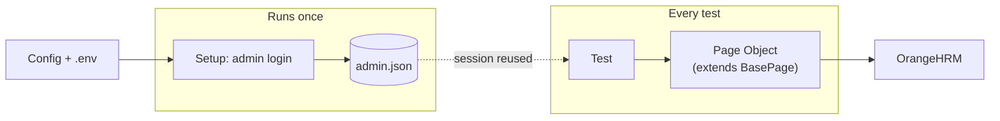
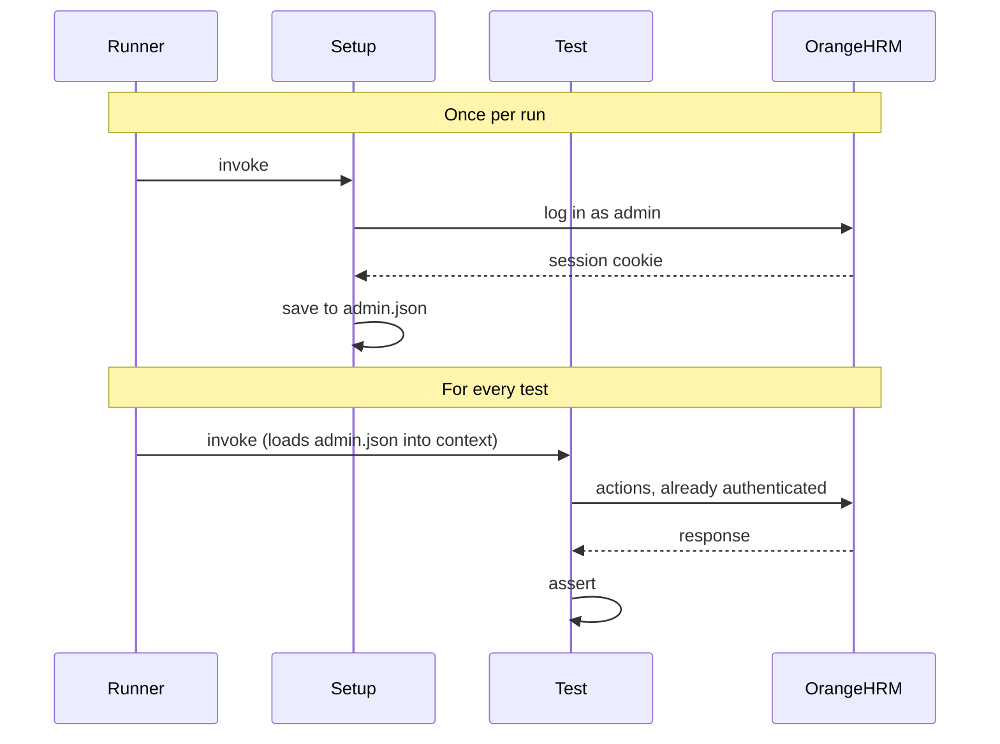

# OrangeHRM — Test Automation Framework

End-to-end test framework for the [OrangeHRM demo site](https://opensource-demo.orangehrmlive.com/), built with **Playwright** and **TypeScript**.

> See [exercise.md](./exercise.md) for the full assignment brief.

## Stack

- **Playwright** — browser automation, runner, reporting, traces.
- **TypeScript** — typed test code.
- **Page Object Model** — page objects under `src/pages`, exposed to tests via Playwright fixtures in `src/fixtures`.
- **Setup project + `storageState`** — admin login runs once per test run; module tests start authenticated.
- **Faker (`@faker-js/faker`)** — realistic names, phones, and emails for test data.
- **dotenv** — `BASE_URL` / credentials are env-overridable, with a committed `.env.example`.
- **ESLint + Prettier + Husky** — flat-config ESLint with the Playwright plugin, Prettier formatting, and a pre-commit hook (lint-staged + `tsc --noEmit`).
- **GitHub Actions CI** — `.github/workflows/test.yml`: lint + typecheck + format on every PR; chromium tests on every push and PR; HTML report deployed to GitHub Pages.

## Project layout

```
.
├── exercise.md                              # Assignment brief
├── playwright.config.ts                     # Runner config: setup project, browser projects, reporters
├── tsconfig.json
├── eslint.config.mjs                        # ESLint 9 flat config
├── .prettierrc.json
├── .husky/pre-commit                        # lint-staged + typecheck
├── .env.example                             # Copy to .env (git-ignored) to override defaults
├── .github/workflows/test.yml               # CI — lint, typecheck, browsers
├── src/
│   ├── config/
│   │   ├── env.ts                           # BASE_URL, ADMIN_USER, ADMIN_PASSWORD (env-overridable)
│   │   └── paths.ts                         # Filesystem paths (e.g. storageState location)
│   ├── data/
│   │   ├── employee-factory.ts              # Generates uniquely-named employee data per test
│   │   ├── candidate-factory.ts             # Generates uniquely-named candidate data per test
│   │   └── setup-helpers.ts                 # createEmployee() — shared arrange-step for PIM tests
│   ├── fixtures/
│   │   └── test-fixtures.ts                 # Custom `test` with all page objects injected
│   └── pages/
│       ├── BasePage.ts                      # Shared `goto()` + label-proximity field helper
│       ├── LoginPage.ts
│       ├── DashboardPage.ts
│       ├── pim/
│       │   ├── EmployeeListPage.ts
│       │   ├── AddEmployeePage.ts
│       │   ├── EmployeePersonalDetailsPage.ts
│       │   └── EmployeeContactDetailsPage.ts
│       └── recruitment/
│           ├── CandidatesPage.ts
│           └── AddCandidatePage.ts
└── tests/
    ├── global.setup.ts                      # Logs in as admin once, saves storageState
    ├── auth/
    │   └── login.spec.ts                    # 3 scenarios: valid / invalid / required validation
    ├── pim/
    │   ├── add-employee.spec.ts             # 6 scenarios (incl. Create Login Details + sign-in)
    │   ├── employee-list.spec.ts            # 3 scenarios
    │   ├── edit-employee.spec.ts            # 3 scenarios (incl. edit-from-list)
    │   └── delete-employee.spec.ts          # 2 scenarios
    └── recruitment/
        ├── add-candidate.spec.ts            # 2 scenarios
        └── candidates-list.spec.ts          # 1 scenario
```

## Architecture

### How the pieces fit together



Tests never log in themselves and never touch raw browser APIs. They call methods on **page objects** (which all extend `BasePage`), and those page objects drive the browser. The session that lets every test skip login is captured **once** by the setup step into `admin.json`.

### What happens during a test run



The login dance happens **once**. Every other test reuses the saved session and starts straight at the page it actually wants to test — that's why 21 tests run in ~2 minutes instead of ~5.

## Prerequisites

- Node.js **18+**
- npm

## Setup

```bash
npm install
npx playwright install        # download browser binaries (chromium, firefox, webkit)
```

`npm install` also runs `husky` (via the `prepare` script) which activates the pre-commit hook.

## Running the tests

```bash
npm test                      # full suite, headless, all browsers (chromium + firefox + webkit)
npm run test:chromium         # chromium only
npm run test:firefox          # firefox only
npm run test:webkit           # webkit (Safari engine) only
npm run test:headed           # full suite with a visible browser
npm run test:ui               # Playwright UI mode — great for development
npm run test:debug            # step-through debugger
npm run report                # open the last HTML report
```

Any extra Playwright flags can be passed through after `--`:

```bash
npm run test:chromium -- --workers=1                  # serial — recommended for the shared demo
npm run test:firefox  -- tests/pim/add-employee.spec.ts
npm test              -- --grep "login"               # only tests matching /login/
```

The `setup` project authenticates once at the start and saves the session to `playwright/.auth/admin.json`; module tests start from that state and skip re-login. The login tests opt out via `test.use({ storageState: { cookies: [], origins: [] } })`.

> **Note** — When iterating against the shared demo, prefer `--workers=1`. The OrangeHRM public demo is throttled and concurrent writes (employee creation in particular) collide. CI is already configured to use 1 worker.

> **Note** — `firefox` and `webkit` browser binaries are downloaded as part of `npx playwright install` (see [Setup](#setup)). If you only ran `npx playwright install chromium`, the firefox/webkit scripts will fail with `Executable doesn't exist` until you install those engines.

## Lint, format, type-check

```bash
npm run lint                  # ESLint with --max-warnings=0
npm run lint:fix              # ESLint --fix
npm run format                # Prettier --write
npm run format:check          # Prettier --check (used in CI)
npm run typecheck             # tsc --noEmit
```

The pre-commit hook runs `lint-staged` (eslint --fix + prettier --write on changed files) and `tsc --noEmit`. To bypass intentionally use `git commit --no-verify`.

## CI

`.github/workflows/test.yml` runs on every push to `main`, every PR to `main`, and on manual dispatch.

- **`lint` job** — ESLint, typecheck, Prettier check.
- **`test` job** — runs the chromium project. The HTML report is uploaded as an artifact (kept 14 days), and on failure the trace, screenshots, and videos are uploaded too. Firefox and webkit can be run locally via `npm run test:firefox` / `npm run test:webkit`.
- **`deploy-report` job** — on push to `main`, publishes the latest chromium HTML report to GitHub Pages. Runs even when tests fail (a failing report is the most useful one).

### Live test report (GitHub Pages)

Once enabled, the latest report from `main` is browsable at:

```
https://<your-github-username>.github.io/<repo-name>/
```

**One-time setup** in the repo (each repo needs this; GitHub doesn't enable Pages automatically):

1. **Settings → Pages**.
2. Under **Build and deployment → Source**, choose **"GitHub Actions"**.
3. Push something to `main`. The `deploy-report` job will publish; the URL is printed in the job's "environment" panel and at _Settings → Pages_.

**How it works under the hood**

- The chromium matrix shard of the `test` job uploads `playwright-report/` as a Pages-compatible artifact via `actions/upload-pages-artifact@v3` (only on pushes to `main`).
- A separate `deploy-report` job (`needs: test`) calls `actions/deploy-pages@v4`, which serves that artifact at the URL above.
- A `concurrency: pages` group prevents two deploys from racing if you push twice in quick succession.

**Permissions** — the `deploy-report` job declares `pages: write` and `id-token: write`. These are scoped to that one job; the rest of the workflow keeps the default least-privilege `contents: read`.

## Configuration

Credentials are **never** hard-coded — they're loaded from a `.env` file locally (auto-loaded via `dotenv`) or from CI secrets in GitHub Actions. `src/config/env.ts` throws at startup if a required value is missing.

```bash
cp .env.example .env          # then edit; .env is git-ignored
```

| Variable         | Required? | Default (when not required)                 |
| ---------------- | --------- | ------------------------------------------- |
| `BASE_URL`       | no        | `https://opensource-demo.orangehrmlive.com` |
| `ADMIN_USER`     | **yes**   | —                                           |
| `ADMIN_PASSWORD` | **yes**   | —                                           |

> The OrangeHRM public demo prints its admin credentials on the login page itself, so for this exercise the values aren't actually secret. The `.env` / repo-secrets pattern is in place anyway because that's how a real project handles credentials — and so the framework drops cleanly into a private OrangeHRM with real creds.

### CI secrets (GitHub Actions)

The workflow reads `ADMIN_USER` and `ADMIN_PASSWORD` from repository secrets:

1. **Settings → Secrets and variables → Actions → New repository secret**
2. Add `ADMIN_USER` (e.g. `Admin`) and `ADMIN_PASSWORD`.
3. The workflow injects them into the Playwright run via the job's `env:` block — they appear as `***` in workflow logs and never end up in the repo.

## What's covered (21 tests)

**Authentication** (3 tests, `tests/auth/login.spec.ts`)

- Valid admin login lands on the Dashboard.
- Invalid credentials show the error alert.
- Empty submission shows required-field validation on both fields.

**PIM** (14 tests, `tests/pim/*.spec.ts`)

- _Add Employee_ (6) — first+last name only; full name + custom employee id; auto-populated id; required-field validation; new employee is searchable; **Create Login Details** toggle + the new user can sign in (verified in a fresh, unauthenticated browser context).
- _Employee List_ (3) — search by name (autocomplete); search by id; reset clears the filter and restores the full list.
- _Edit Employee_ (3) — updates personal details (Other Id + License Number); updates contact details (Mobile + Work Email); **edits an employee from the employee list** by clicking the row's pencil icon. All assert persistence after a page reload.
- _Delete Employee_ (2) — confirms via the dialog and the employee is gone; cancelling the dialog keeps the employee.

**Recruitment** (3 tests, `tests/recruitment/*.spec.ts`)

- _Add Candidate_ — creates a candidate with required fields and lands on the candidate profile (post-save URL match); required-field validation for empty first/last name + email.
- _Candidates List_ — loads with the seeded demo candidates rendered.

> **Heads-up on intermittent CI failures.** One test — `PIM — Add Employee › creates an employee with first + last name and lands on Personal Details` — can fail intermittently on the public demo because of a real defect in OrangeHRM's auto-generated Employee Id (race condition under concurrent writes). The test is **deliberately not patched** to mask this. See [Findings during automation](#findings-during-automation) for the full bug report.

## Notable design choices

- **Label-proximity field helper.** OrangeHRM's inputs lack `for`/`id` associations and most don't carry `name` attributes either, so neither `getByLabel` nor `input[name="..."]` works in general. `BasePage.fieldByLabel(label)` returns the first `input`/`textarea` that follows the matching label in document order — robust across PIM, Personal Details, Contact Details, and Recruitment forms which all use slightly different DOM wrappers.
- **`pressSequentially` for v-model inputs.** Several Vue-driven inputs (Contact Details, Personal Details extras, Add Candidate) don't pick up `fill()` because their `v-model.lazy` doesn't react to programmatic value sets. Real keystrokes via `pressSequentially` work. Login + Add Employee use `fill()` because their inputs do bind correctly.
- **Native-setter + `input`/`change` events for the Employee Id search.** That filter input proved especially flaky under demo load, so the Employee List page object sets the value via the native `HTMLInputElement` setter and dispatches synthetic `input`/`change` events — bypasses keystroke-timing entirely.
- **Faker for realism, timestamp for uniqueness.** Names, phones, and emails come from Faker (`faker.person.firstName()`, `faker.internet.email()`, etc.) so trace screenshots read naturally ("Sarah Murphy" vs `Auto256205 Userv4`). The Employee Id is _not_ Faker-driven — OrangeHRM rejects duplicates and caps the field at 10 chars, so `generateEmployee()` keeps a `${timestamp}${random}` 8-char id for guaranteed uniqueness across runs.
- **Fresh context for the new-user-sign-in test.** The "Create Login Details" PIM test verifies the brand-new user can authenticate by spinning up an unauthenticated context (`browser.newContext({ storageState: { cookies: [], origins: [] } })`) and signing in there — proves the credentials really work, not just that the form thinks it saved.
- **No teardown of created employees / candidates.** The shared demo accumulates test data over time. Cleaning up via the UI in `afterEach` would slow the suite materially and add a failure path; left as a trade-off, see "Future work" below.
- **Timeouts tuned for a healthy demo, not the slowest possible day.** The public demo's response times can swing 5–10× between calm and busy periods. The default Playwright timeouts (5s `expect`, 15s navigation, 30s per test) are tuned for normal demo speeds; on slow days, tests can time out even when the framework is correct. CI is configured with `retries: 2` to absorb that noise. Permanently inflating timeouts to "make CI green" would mask exactly the signal we want to keep — _"this code works against a healthy SUT but the SUT isn't always healthy."_ The principled fix is to self-host OrangeHRM (see Future Work) and remove the noise at source.

## Findings during automation

Building this suite surfaced three real defects in the application. They're documented here as I'd document them in a real engagement — a tester's job isn't only to write green tests, it's to feed defects back to the product team. The tests that expose them are **deliberately left as-is** wherever the failure is genuinely the application's fault; the one defensive wait we added (form-loader overlay) is bounded and is documented as such.

### OrangeHRM auto-generated Employee Id race condition

| Field               | Value                                                                       |
| ------------------- | --------------------------------------------------------------------------- |
| **Severity**        | P3 / Medium — non-blocking, intermittent, has a manual workaround.          |
| **Module**          | PIM > Add Employee                                                          |
| **Affected build**  | OrangeHRM OS 5.8 (public demo, `https://opensource-demo.orangehrmlive.com`) |
| **Reproducibility** | Intermittent — correlates with concurrent writes against the same database. |
| **First observed**  | GitHub Actions chromium run, 2026-05-15.                                    |

**Steps to reproduce**

1. Log in as Admin.
2. Navigate to **PIM → Add Employee**. The Employee Id field is auto-populated by the application (e.g. `0505`).
3. Fill First Name and Last Name. **Do not** modify the auto-populated Employee Id.
4. Click **Save**.

**Expected**
The employee is created. The browser is redirected to the new employee's Personal Details page (URL pattern `/pim/viewPersonalDetails/empNumber/<id>`).

**Actual**
The Save click submits but the redirect doesn't happen. The page stays on `/pim/addEmployee`. An inline validation error appears under the Employee Id field:

> Employee Id already exists

There is no toast, modal, or other top-level signal — only the inline message. The user has to recognise that the _system-supplied_ value is the problem, manually edit it, and Save again.

**Likely root cause**
The auto-populated Employee Id appears to be computed at page-load (probably `MAX(id) + 1` or a similar deterministic scheme). The value is **not transactionally reserved** — between page-load and the Save click, another concurrent request can claim the same id, leaving this submission to fail at the uniqueness constraint. Two contributing factors compound it on the public demo:

- The shared demo handles writes from many concurrent users, so the window for collision is wider than on a private instance.
- Deleted employees may free their ids back into the auto-generation space, increasing collision likelihood as the database churns.

**Evidence in this suite**

`tests/pim/add-employee.spec.ts > "creates an employee with first + last name and lands on Personal Details"` is the only PIM-Add scenario that intentionally does **not** override the auto-populated Employee Id (the test exercises the _minimum required fields_ flow, as a real user would). It fails intermittently in CI for exactly the reason above. Other PIM-Add tests pass reliably because they all call `setEmployeeId(employee.employeeId)` with a guaranteed-unique id from `generateEmployee()`.

CI artifact for the failure: HTML report shows the inline `"Employee Id already exists"` error; trace shows the Save POST returning to the same URL instead of the expected 302.

**Workarounds (and why we didn't apply them in tests)**

- **In the test:** add `await addEmployeePage.setEmployeeId(employee.employeeId)` before Save. _Not applied_ — masking the application bug behind a test workaround would defeat the test's purpose. The test exists to catch exactly this kind of regression. If it stays red intermittently, that's a signal the bug is still live.
- **In the application (proper fix):** either reserve the id transactionally on page-load, or re-generate-and-validate on Save with a server-side retry on uniqueness conflict.

**Recommendation**
File against the OrangeHRM open-source repository. Note that on a private OrangeHRM instance with no concurrent traffic this defect is much harder to reproduce — which is itself useful information when triaging.

### OrangeHRM `/auth/validate` hang under repeated failed-login attempts

| Field               | Value                                                                                                     |
| ------------------- | --------------------------------------------------------------------------------------------------------- |
| **Severity**        | P4 / Low — affects only automated invalid-credentials tests; humans rarely hit it.                        |
| **Module**          | Authentication > Login                                                                                    |
| **Affected build**  | OrangeHRM OS 5.8 (public demo, `https://opensource-demo.orangehrmlive.com`)                               |
| **Reproducibility** | Intermittent on the public demo; correlates with frequency of failed-login attempts from the same client. |
| **First observed**  | GitHub Actions chromium run, 2026-05-25.                                                                  |

**Steps to reproduce**

1. From a single client, submit a POST to `/web/index.php/auth/validate` with invalid credentials.
2. Repeat several times in close succession (e.g. CI loops over login regression tests).
3. After ~N attempts, observe that subsequent POSTs hang without returning a response.

**Expected**
Every invalid-credentials submission returns within a reasonable window with the standard `.oxd-alert-content--error` banner ("Invalid credentials") rendered on the page.

**Actual**
The browser stays on `/auth/login` _waiting for navigation to finish_ — the POST is in flight but no response arrives within the test's 5-second window. The error banner never renders because the page is mid-request. The valid-credentials login flow continues to work normally during the same window, so the issue is specific to failed attempts.

**Likely root cause**
Soft rate-limiting / throttling on the public demo to discourage brute-force credential probing. Reasonable behaviour for an internet-facing demo, but it has the side-effect of breaking automated invalid-credentials tests that intentionally submit wrong credentials at machine speed.

**Evidence in this suite**

`tests/auth/login.spec.ts > "shows an error for invalid credentials"` failed all three retries in CI with:

```
Locator: locator('.oxd-alert-content--error')
Expected: visible
Call log:
  - waiting for locator('.oxd-alert-content--error')
    - waiting for "/web/index.php/auth/validate" navigation to finish...
```

The test's logic is correct: submit wrong creds → assert the error banner appears. It fails because the _server's response_ doesn't arrive, not because our locator is wrong.

**Workarounds (and why we didn't apply them in tests)**

- **In the test:** add a longer timeout, or retry the whole login submission. _Not applied_ — would mask intermittent server unavailability behind apparent test success.
- **In the deployment (proper fix):** if rate-limiting is intentional, document it explicitly and return a clear HTTP status (e.g. 429) instead of hanging. Test code can then assert on that response.

**Recommendation**
File against the OrangeHRM demo's deployment configuration. On a private OrangeHRM instance without rate-limiting middleware, this issue is unlikely to reproduce — again, useful triage information.

### OrangeHRM `.oxd-form-loader` overlay intercepts clicks during page hydration

| Field               | Value                                                                                    |
| ------------------- | ---------------------------------------------------------------------------------------- |
| **Severity**        | P3 / Medium — race condition; affects automation more than humans (who naturally pause). |
| **Module**          | PIM > Personal Details, PIM > Contact Details (any data-bound form).                     |
| **Affected build**  | OrangeHRM OS 5.8                                                                         |
| **Reproducibility** | Reliable under slow demo load; intermittent otherwise.                                   |
| **First observed**  | GitHub Actions chromium run, 2026-05-25 (10.3 min slow run).                             |

**Steps to reproduce**

1. Navigate to a data-bound form (e.g. `/pim/viewPersonalDetails/empNumber/<id>` via the Employee List's pencil-icon).
2. Immediately attempt to click an input on the form.

**Expected**
The click registers. The page header has rendered, the URL has updated, and form inputs are visible.

**Actual**
A short-lived `<div class="oxd-form-loader">` overlay sits on top of the form while data hydrates. Any click in that window is intercepted by the overlay rather than reaching the input. There is no visible _blocking_ spinner — the form appears interactable but isn't.

**Likely root cause**
The form-loader element is added to the DOM as a click-shield while Vue fetches and binds employee data into the form. The header and inputs are rendered eagerly (which is why `expectLoaded()` checks pass), but the overlay isn't removed until data binding completes.

**Workaround applied in this suite**
`EmployeePersonalDetailsPage.expectLoaded()` and `EmployeeContactDetailsPage.expectLoaded()` now wait for `.oxd-form-loader` to reach the `hidden` state (with a 10-second cap and a swallowed timeout). This is one of the few places where a defensive wait is justified: the loader is an OrangeHRM-side rendering quirk, not something user-facing tests should assert on, and the wait is bounded.

**Recommendation**
On the application side, either render the form skeleton-only until data has bound, or make the overlay non-interactive (`pointer-events: none`) and use the inputs' own `disabled` state instead.

## Future work / trade-offs

- **Test data teardown.** Add an `afterEach` that deletes the created employee/candidate via the OrangeHRM REST API rather than the UI — fast and keeps the demo tidy.
- **Self-hosted OrangeHRM in CI via Docker.** The OrangeHRM project ships a Docker image. Using it as a CI service container would let us drop `--workers=1` (the public demo throttles + has write collisions), reset the DB between runs (deterministic state), and pin a known version. Single biggest reliability + speed win.
- **Visual / accessibility checks.** `toHaveScreenshot` for stable pages and `@axe-core/playwright` for accessibility regressions on key views.
- **More module coverage.** Bulk delete (multi-row checkboxes), profile picture upload, supervisor assignment, termination flows, plus a second non-trivial module (Time / Leave).
- **Reporting.** Allure or Monocart reporter for richer history if this were a long-lived suite.
